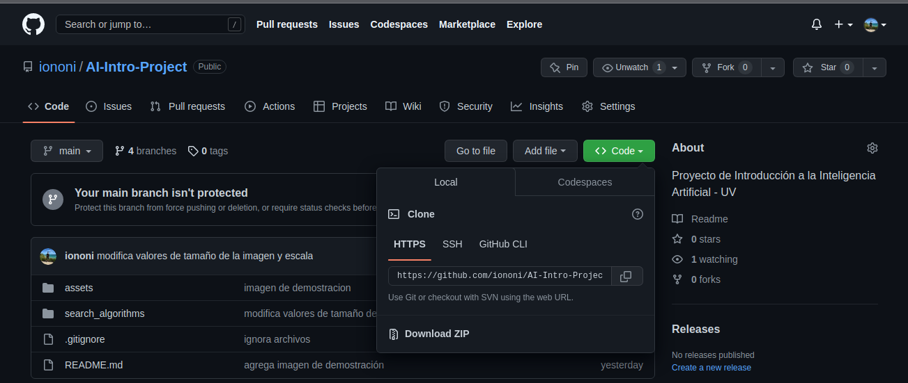
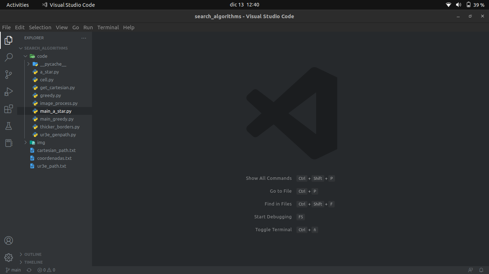

# Descripción
El presente proyecto integrador tiene como finalidad aplicar los temas vistos durante el curso _Introducción a la Inteligencia Artificial_, de los cuales podemos destacar:

* Agentes inteligentes
  * Agentes y su entorno
  * Racionalidad
  * Medidas de rendimiento
* El entorno
  * Especificación del entorno
  * Propiedades de los entornos
* Estructura de los agentes
  * Agentes reactivos simples
  * Agentes reactivos basados en modelos
  * Agentes basados en objetivos
  * Agentes basados en utilidad
  * Agentes que aprenden
* Resolución de problemas mediante búsqueda
  * Estrategias de búsqueda no informada
    * Búsqueda primero en anchura
    * Búsqueda primero en profundidad (y profundidad limitada)
  * Búsqueda informada y exploración
    * Heurísticas
    * Greedy
    * A*
    
# Manos a la obra
La ***idea principal*** es crear un agente capaz de encontrar la salida, o mejor dicho, el camino que conduce a la salida en un laberinto. Para cumplir tal propósito es necesario, en primera instancia, un laberinto y un algorimo capaz de hallar la secuencia de pasos a seguir para encontrar la salida. Para llevar el desafío un paso más allá, nuestro agente estará conformado de dos componentes: un brazo robótico que le permitirá interactuar con el mundo exterior (su entorno) de manera que pueda trazar el camino en un laberinto físico, y un software que permita representar el entorno para encontrar la solución. El objetivo es dotar a nuestro agente de la capacidad de visualizar el entorno, o al menos el laberinto a resolver, para que pueda cumplir con su función. Para ello el agente recibe la imagen de algún laberinto, la cual servirá como entrada para el componente de software que aplicará algoritmos de procesamiento de imágenes y algoritmos de búsqueda para tener una visión más clara del entorno y poder encontrar la solución al problema.

# Trabajo futuro
Como siguiente objetivo se tiene el uso de una cámara en el agente que le permita tomar la foto del laberinto y realizar todo el proceso descrito anteriormente de manera autónoma.

# Integrantes
* Cerecero Amador María Cristina ([XtinaCerecero](https://github.com/XtinaCerecero))
* Salgado Gómez Kevin ([KevinSg](https://github.com/KevinSalgado))
* Sosa Guzmán Mariana ([MarianaS01](https://github.com/MarianaS01))
* Ruíz Ríos Eduardo ([iononi](https://github.com/iononi))

# Imagen de demostración


# Modo de uso
Para hacer uso del programa, puede hacerlo de las siguientes dos maneras:
1. Si cuenta con git en su computadora, puede clonar el repositorio
2. En caso de no contar con git instalado en su computadora, puede descargar el proyecto como un archivo comprimidp ZIP

### 1. Clonar repositorio
Para clonar el repositorio en su computadora usted debe abrir su terminal y posicionarse en el directorio donde desee que se descargue el repositorio. Una vez hecho esto procederá a ejecutar el siguiente comando:
```bash
git clone https://github.com/iononi/AI-Intro-Project.git
```

Una vez realizado estos pasos ya habrá descargado el proyecto y puede ejecutarlo o realizar los cambios que considere pertinentes según lo necesite.

### 2. Descargar el archivo comprimido ZIP
Usted deberá hacer clic sobre la opción identificada con `Code` y ahí tendrá la opción de descargar el archivo comprmido ZIP dando clic en la opción `Download ZIP`, como se muestra en la imagen:


Esto iniciará el proceso de descarga que se verá reflejado en su navegador. Cuando la descarga haya finalizado, usted es libre de posicionar en su sistema el archivo descomprimido donde prefiera.

### Ejecución del programa
Para poder ejecutar el programa, usted debe cumplir con los siguientes requisitos de software:
- IDE o editor de código, como [Visual Studio Code](https://code.visualstudio.com/), [PyCharm](https://www.jetbrains.com/es-es/pycharm/) o [Sublime Text](https://www.sublimetext.com/) (para este último, deberá asegurarse de tener una manera de ejecutar código python desde el mismo editor, como `SublimeREPL`)
- Python 3.7.x o mayor
- Los siguientes módulos de python instalados: `numpy`, `PIL`, `opencv-python`. Si no cuenta con ellos, puede ver el apartado [Instalación de módulos](https://github.com/iononi/AI-Intro-Project#instalación-de-módulos)

Puede ejecutar el programa desde la terminal (si cuenta con los conocimientos suficientes) o también puede optar por abrir el proyecto desde un IDE o editor de código como los anteriormente nombrados. En cualquiera de los casos, deberá asegurarse de abrir el proyecto desde la carpeta `search_algoritms`. En su editor de código debe verse similar a esto:

**Visual Studio Code**



**Terminal - Linux/Mac**

```bash
cd AI-Intro-Project/search_algorithms
```

**Terminal - Windows**

```cmd
cd AI-Intro-Project\search_algorithms
```

Una vez posicionados en esta carpeta, puede ejecutar el proyecto correctamente. Si lo realiza desde la terminal ejecute el siguiente comando:

**Terminal Linux/Mac**

```bash
python3 code/[main_a_star.py|main_greedy.py]
```

**Terminal Windows**

```cmd
python code\[main_a_star.py|main_greedy.py]
```

> **TIP:** en Windows si descargó Python desde la página oficial el ejecutable será `python`. En cambio si lo instaló desde algún manejador de paquetes como `winget` o `choco` puede ser que su ejecutable sea `python3`.

# Instalación de módulos
Para instalar los módulos siguientes debe contar con Python y su manejador de paquetes `pip`. Para instalarlos deberá correr los siguientes comandos:
```bash
pip install numpy
pip install opencv-python
pip install PIL
```

Si no cuenta con pip puede ejecutar los siguientes comandos:

**Terminal Linux/Mac**

```bash
python3 -m pip install numpy
python3 -m pip install opencv-python
python3 -m pip install PIL
```

**Terminal Windows**

```cmd
python -m pip install numpy
python -m pip install opencv-python
python -m pip install PIL
```
