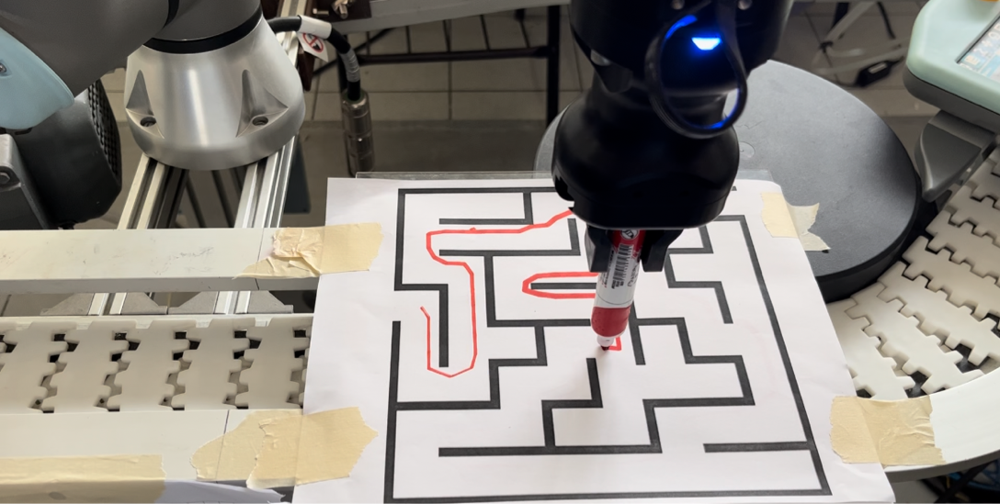

# Descripción
El presente proyecto integrador tiene como finalidad aplicar los temas vistos durante el curso _Introducción a la Inteligencia Artificial_, de los cuales podemos destacar:

* Agentes inteligentes
  * Agentes y su entorno
  * Racionalidad
  * Medidas de rendimiento
* El entorno
  * Especificación del entorno
  * Propiedades de los entornos
* Estructura de los agentes
  * Agentes reactivos simples
  * Agentes reactivos basados en modelos
  * Agentes basados en objetivos
  * Agentes basados en utilidad
  * Agentes que aprenden
* Resolución de problemas mediante búsqueda
  * Estrategias de búsqueda no informada
    * Búsqueda primero en anchura
    * Búsqueda primero en profundidad (y profundidad limitada)
  * Búsqueda informada y exploración
    * Heurísticas
    * Greedy
    * A*
    
# Manos a la obra
La ***idea principal*** es crear un agente capaz de encontrar la salida, o mejor dicho, el camino que conduce a la salida en un laberinto. Para cumplir tal propósito es necesario, en primera instancia, un laberinto y un algorimo capaz de hallar la secuencia de pasos a seguir para encontrar la salida. Para llevar el desafío un paso más allá, nuestro agente estará conformado de dos componentes: un brazo robótico que le permitirá interactuar con el mundo exterior (su entorno) de manera que pueda trazar el camino en un laberinto físico, y un software que permita representar el entorno para encontrar la solución. El objetivo es dotar a nuestro agente de la capacidad de visualizar el entorno, o al menos el laberinto a resolver, para que pueda cumplir con su función. Para ello el agente recibe la imagen de algún laberinto, la cual servirá como entrada para el componente de software que aplicará algoritmos de procesamiento de imágenes y algoritmos de búsqueda para tener una visión más clara del entorno y poder encontrar la solución al problema.

# Trabajo futuro
Como siguiente objetivo se tiene el uso de una cámara en el agente que le permita tomar la foto del laberinto y realizar todo el proceso descrito anteriormente de manera autónoma.

# Integrantes
* Cerecero Amador María Cristina ([XtinaCerecero](https://github.com/XtinaCerecero))
* Salgado Gómez Kevin ([KevinSg](https://github.com/KevinSalgado))
* Sosa Guzmán Mariana ([MarianaS01](https://github.com/MarianaS01))
* Ruíz Ríos Eduardo ([iononi](https://github.com/iononi))

# Imagen de demostración

